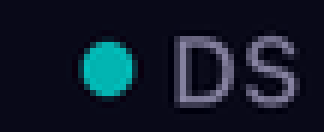
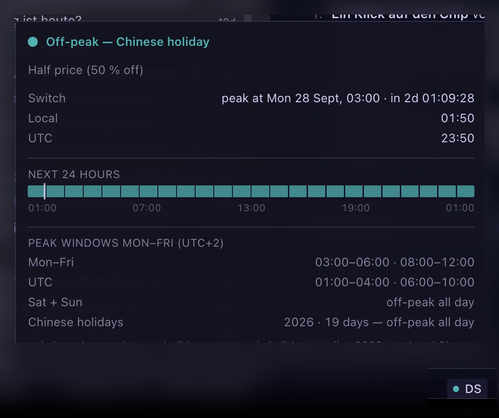

# DeepSeek Peak — Hermes desktop plugin

A status-bar chip for the [Hermes desktop app](https://hermes-agent.nousresearch.com/docs) that shows
whether the DeepSeek API is currently in **peak** hours (double price) or **off-peak** hours (half
price).



The chip is the plugin: a green dot means cheap (off-peak or Chinese public holiday), red means
expensive (peak). Hovering it shows the state, the price factor and the countdown to the next switch.

Everything else is optional detail — clicking the chip opens the panel (or use the command palette:
⌘K → `DeepSeek Peak: show/hide panel`):



| Surface | Content |
| --- | --- |
| Status-bar chip (the point) | `DS` + colored dot, always visible; the tooltip carries state, price factor and the one-second countdown to the next switch. |
| Panel (optional) | Current state and price, next switch (local time + countdown), 24-hour price timeline, peak windows local and UTC, holiday rules. |
| Command palette | `DeepSeek Peak: show/hide panel` (⌘K) |

## The rule

From <https://api-docs.deepseek.com/quick_start/pricing>:

> Off-peak rates are half of the peak rates. Peak hours are 01:00 - 04:00 and 06:00 - 10:00 UTC,
> Monday through Friday, excluding Chinese public holidays. All other hours are off-peak, including
> weekends and Chinese public holidays in full.

Both peak windows sit inside 09:00–18:00 CST (UTC+8) on the same calendar day they occupy in UTC, so
a Chinese public holiday can be listed as its UTC calendar date (`CN_HOLIDAYS_UTC`). The list comes
from the State Council's annual notice (2026: 国办发明电〔2025〕7号, see the link in the file header)
and has to be extended once a year.

## Timezones

All state math runs in UTC; every displayed time is rendered in the timezone of the machine the app
runs on. The panel shows the windows in local time next to the UTC reference, so the same plugin is
correct anywhere on the planet.

## Install

```bash
git clone https://github.com/Kumear/hermes-deepseek-offpeak.git \
  ~/.hermes/desktop-plugins/hermes-deepseek-offpeak
```

Hermes loads desktop plugins from `~/.hermes/desktop-plugins/<name>/plugin.js` — plain ESM, no build
step, no dependencies (`@hermes/plugin-sdk` comes with the app). The folder name is free; the plugin
identifies itself by the id inside the file. Restart the app if the chip does not show up; after that
the file is hot-reloaded on save.

## Usage notes

- The chip is the always-on surface. The panel opens on a chip click or from the command palette and
  closes without side effects — closing it never disables the plugin.
- On desktop builds without `host.openWorkspace` the plugin falls back to a permanently docked pane.
  Closing *that* pane disables the whole plugin (app-side behaviour): re-enable it under
  **Settings → Plugins**.
- The plugin id (`deepseek-peak-v2`) is the plugin's identity — the app keys pane placement and its
  enable/disable decision by it, so treat it as permanent once installed.

## Requirements

A Hermes desktop build with the plugin SDK: contribution areas `statusBar.right`, `panes`, `palette`
and a locale bundle registry. Developed and verified against Hermes desktop 0.21.5 on macOS.

## License

MIT — see [LICENSE](LICENSE).
